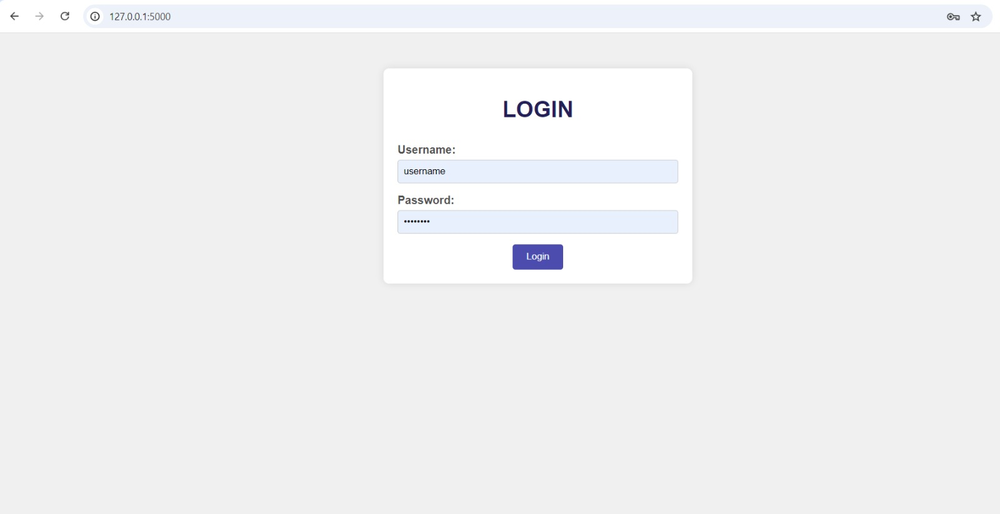

# DSA2024
## ATTENDANCE MANGEMENT SYSTEM USING CAM
 The Attendance Management System using Web Cam is a modern solution that automates the process of recording and managing attendance by leveraging facial recognition technology through a webcam
 - Facial Recognition Technology:
    - The system uses a webcam to capture live images or video streams of individuals.
- Real time attendence loging:

    - Every individual’s face is linked to their profile in the system’s database.
    - When the face is recognized by the webcam, the system automatically records attendance along with a timestamp.
- Report generation
    - The system generates reports showing attendance on selected date.
    - Administrators can monitor patterns, identify absentees

Conclusion:

The Attendance Management System using Web Cam provides an efficient and automated way to manage attendance, improving productivity and accuracy in organizations. By leveraging facial recognition technology, it offers a modern and user-friendly solution that can easily be implemented in various domains like schools, offices, and events.

## Screenshot of current UI

## Algorithm used

- deep learning using CNN (Convolutional Neural Network)

    -  A Convolutional Neural Network (CNN) is a type of deep learning algorithm that is particularly effective for tasks involving image and video data. CNNs are widely used in computer vision applications, such as image classification, object detection, and facial recognition, as well as in other fields like medical imaging and natural language processing.

## Database 

- **Database:** The system uses a SQLite database to manage employee, department, and attendance data.
  - **employees table:** Stores details of employees, such as their ID, name, department, email, phone number, date of birth, address,hire date,termination date.
  - **departments table:** Stores department information, including department ID and department name.
  - **attendance table:** Records the attendance of employees, capturing their check-in time, check-out time, date, and attendance status.

## Tables in Database

### Employees Table
The `employees` table stores employee details such as:
- `employee_id` (Primary Key)
- `employee_name`
- `department_id` (Foreign Key)
- `email`
- `phone_number`
- `dob` (date of birth)
- `address`
- `photo` (Stores multiple images of the employee for camera detection)
- `hire_date`
- `termination_date`

### Departments Table
The `departments` table holds information related to departments:
- `department_id` (Primary Key)
- `department_name`

### Attendance Table
The `attendance` table logs employee attendance, including:
- `attendance_id` (Primary Key)
- `employee_id` (Foreign Key)
- `checkin_time`
- `checkout_time`
- `attendance_date`
- `status` (Present/Absent)

## Features

1. **Camera Detection:** 
   The system captures and stores up to 5 photos per employee for camera detection. These photos are used for real-time attendance tracking by matching the detected employee with the images in the database.

2. **Real-time Attendance:** 
   The system can query real-time attendance data to check how many employees are present at any given moment.

3. **Department Integration:** 
   Attendance records are linked to department data, allowing reports to be generated based on departments as well.

## Model Architecture Trained

The following image shows a Convolutional Neural Network (CNN) architecture for our model classification. It starts with a Conv2D layer that takes input images of shape (150, 150, 3) and applies 32 filters, producing an output of (148, 148, 32). This is followed by a MaxPooling2D layer that reduces the spatial dimensions to (74, 74, 32). Another Conv2D layer with 64 filters outputs a feature map of shape (72, 72, 64), which is further downsampled by a MaxPooling2D layer to (36, 36, 64). A third Conv2D layer with 128 filters outputs a map of (34, 34, 128), and the final MaxPooling2D layer reduces it to (17, 17, 128). The feature map is then flattened into a 1D vector of 36,992 units, followed by a Dense layer with 128 units, and Dropout is applied for regularization. Finally, a Dense layer with 5 units outputs the classification results for 5 classes. This architecture efficiently extracts features and classifies input images.

## Result 

| Model | Accuracy | Prediction Time |
|-------|----------|-----------------|
| CNN   | 100%     | - sec           |

